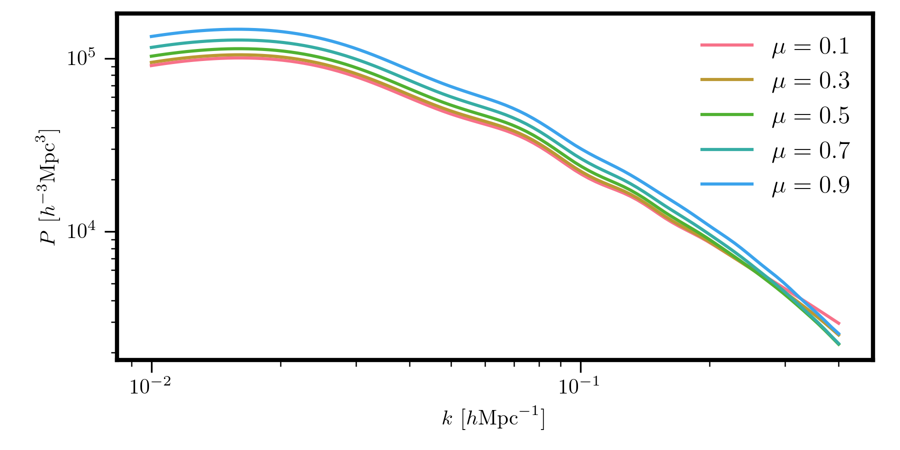
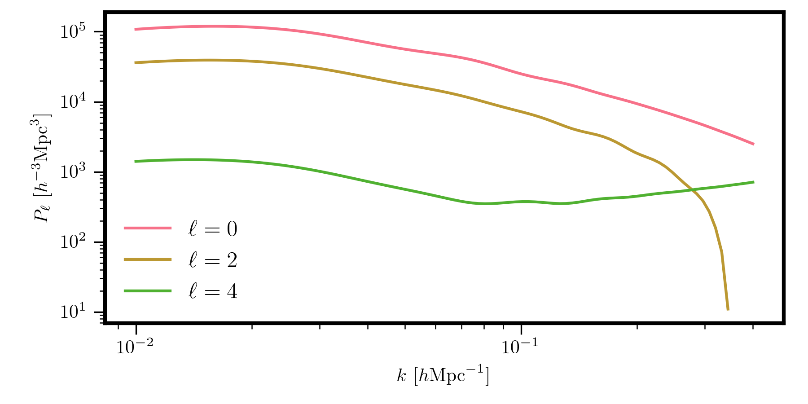

Computing Power Spectra
=======================

.. currentmodule:: pyRSD.rsd

With an initialized model, we can compute the power spectrum either
as a function of :math:`k` and :math:`\mu`, :math:`P(k,\mu)`, or compute
the multipoles of the power spectrum, :math:`P_\ell(k)`. This
is accomplished either by calling the :func:`GalaxySpectrum.power`
or :func:`GalaxySpectrum.poles` functions.

For example, to compute :math:`P(k,\mu)` for 5 :math:`\mu` bins:

.. code-block:: python

    k = numpy.logspace(-2, numpy.log10(0.4), 100)

    # this is mu = 0.1, 0.3, 0.5, 0.7, 0.9
    mu = numpy.arange(0.1, 1.0, 0.2)
    Pkmu = model.power(k, mu) # shape is (100,5)

    for i, imu in enumerate(mu):
      plt.loglog(k, Pkmu[:,i], label=r"$\mu = %.1f$" %imu)

And, for example, the monopole, quadrupole, and hexadecapole (:math:`\ell=0,2,4`)
can be computed as

.. code-block:: python

    ells = [0, 2, 4]
    Pell = model.poles(k, ells) # list of 3 (100,) arrays

    for i, ell in enumerate(ells):
      plt.loglog(k, Pell[i], label=r"$\ell = %d$" %ell)

