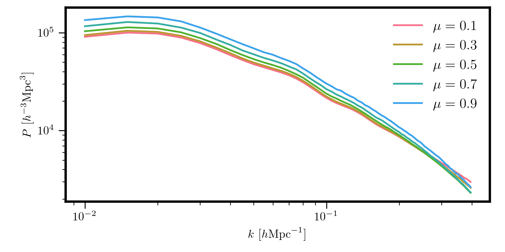
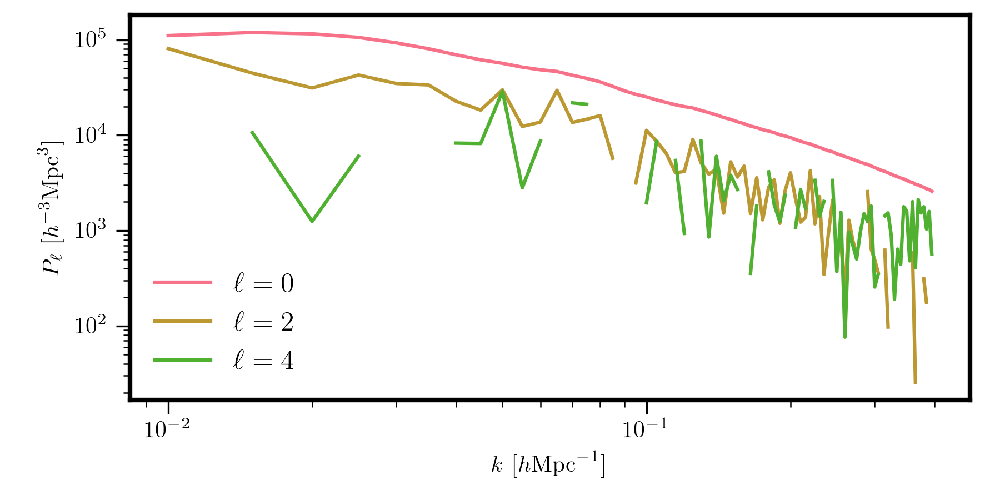

.. _discrete-binning:

Discrete Binning Effects
========================

.. currentmodule:: pyRSD.rsd

When computing the power spectrum from galaxy survey data, we estimate
the power in bandpowers, averaging over a finite set of modes in each
:math:`k` or :math:`\mu` bin. Especially on large scales (low :math:`k`),
where we are averaging over relatively few values, this averaging
procedure can lead to additional effects on the power spectrum. The
pyRSD package accounts for these effects by applying an additional transfer
function to the continuous power spectrum that is returned by
:func:`GalaxySpectrum.power` or :func:`GalaxySpectrum.poles`.

The discretely-binned power spectrum theory is computed by either the
:class:`PkmuTransfer` or :class:`PolesTransfer` classes, depending if the user
wants :math:`P(k,\mu)` or :math:`P_\ell(k)`. A transfer function can be
initialized, and then the discretely-binned power spectrum theory will be
returned by the :func:`GalaxySpectrum.from_transfer` function.

Specifying the (:math:`k`, :math:`\mu`) Grid
--------------------------------------------

In order to account for the discrete binning effects, the user must supply
the average :math:`k` and :math:`\mu` values on the 2D binning grid, as well
as the number of modes averaged over in each bin. These bins should be
finely spaced, typically about ~100 :math:`\mu` bins yields good results.
The continuous theory will be evaluted for each these discrete bins, and
then averaged over, weighted by the number of modes in each bin, to
account for any binning effects.

The class that handles setting up the :math:`P(k,\mu)` grid is
:class:`PkmuGrid`. This class can be initialized

.. ipython:: python
    :suppress:

    import numpy
    from pyRSD.rsd import PkmuGrid
    numpy.random.seed(100)

.. ipython:: python
    :okwarning:

    # set up fake 1D k, mu bins
    k_1d = numpy.arange(0.01, 0.4, 0.005)
    mu_1d = numpy.linspace(0, 1.0, 100)

    # convert to a 2D grid
    # shape is (78, 100)
    k, mu = numpy.meshgrid(k_1d, mu_1d, indexing='ij')

    # assign random weights for each bin for illustration purposes
    modes = numpy.random.random(size=k.shape)

    # simulate missing data
    missing = numpy.random.randint(0, numpy.prod(modes.shape), size=10)
    modes.flat[missing] = numpy.nan

    # initialize the grid
    grid = PkmuGrid([k_1d, mu_1d], k, mu, modes)
    print(grid)

Once a :class:`PkmuGrid` object has been initialized, we can save it to disk
as a plaintext file for later use.

.. ipython:: python

    # save to a plaintext file
    grid.to_plaintext('pkmu_grid.dat')

    # read the grid back from disk
    grid_2 = PkmuGrid.from_plaintext('pkmu_grid.dat')
    print(grid_2)

.. ipython:: python
    :suppress:

    import os
    os.remove('pkmu_grid.dat')

Discrete :math:`P(k,\mu)`
-------------------------

Once the binning grid is initialized, we next must initialize the
desired transfer function. Imagine we want to compute the power
spectrum in 5 :math:`\mu` bins, accounting for discrete binning effects.
This can be achieved as

.. code-block:: python

    # edges of the mu bins
    mu_bounds = [(0., 0.2), (0.2, 0.4), (0.4, 0.6), (0.6, 0.8), (0.8, 1.0)]

    # the transfer function, with specified valid k range
    transfer = PkmuTransfer(grid, mu_bounds, kmin=0.01, kmax=0.4)

    # evaluate the model with this transfer function
    Pkmu_binned = model.from_transfer(transfer)

    # get the coordinate arrays from the grid
    k, mu = transfer.coords # this has shape of (Nk, Nmu)

    for i in range(mu.shape[1]):
      plt.loglog(k[:,i], Pkmu_binned[:,i], label=r"$\mu = %.1f$" % mu[:,i].mean())

Discrete :math:`P_\ell(k)`
--------------------------

We can similarly compute multipoles while accounting for discrete binning
effects. This can be achieved as

.. code-block:: python

    # the multipoles to compute
    ells = [0, 2, 4]

    # the transfer function, with specified valid k range
    transfer = PolesTransfer(grid, ells, kmin=0.01, kmax=0.4)

    # evaluate the model with this transfer function
    poles_binned = model.from_transfer(transfer) # shape is (78, 3)

    # get the coordinate arrays from the grid
    k, mu = transfer.coords # this has shape of (Nk, Nmu)

    for i, iell in enumerate(ells):
      plt.loglog(k[:,i], poles_binned[:,i], label=r"$\ell = %d$" % iell)

