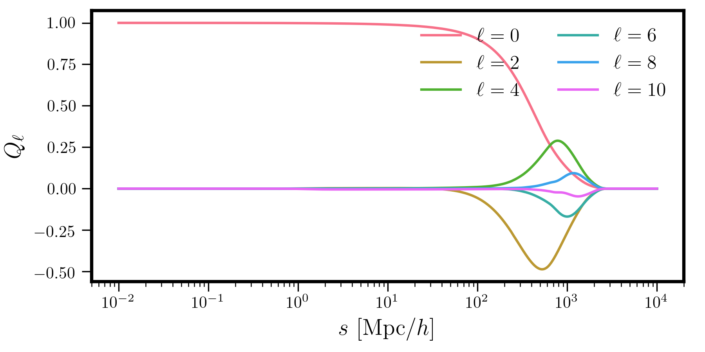
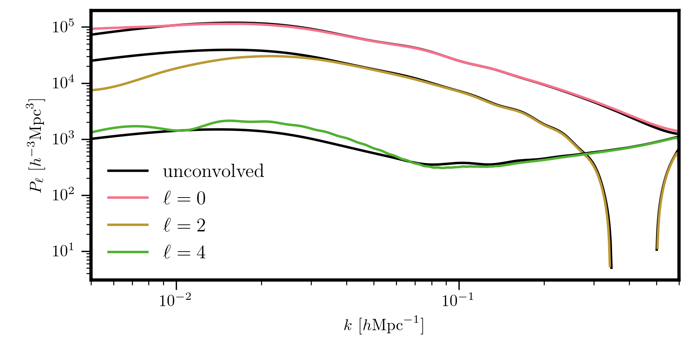

.. _window-power:

Window-convolved Power Spectra
==============================

When analyzing power spectrum measurements from a galaxy survey, the theoretical
quantity of interest is the power spectrum convolved with the survey window function,
which arises due to the presence of the survey selection function.
In particular, the most common power spectrum spectrum from galaxy survey data
is the window-convolved power spectrum multipoles.
See `1704.02357 <https://arxiv.org/abs/1704.02357>`_ for more
details about how this measurement is made from survey data.

The pyRSD package includes functionality for computing the theoretical
power spectrum multipoles convolved with a window function input by the
user. The window convolution procedure implemented in pyRSD is described
in detail in `Wilson et al. 2017 <https://arxiv.org/abs/1511.07799>`_, as
well as in Section 4.3.2 of `1706.02362 <https://arxiv.org/abs/1706.02362>`_.
Please see these references for further details about the algorithm.

Specifying the Window Function
------------------------------

In order to convolve the theoretical power spectrum multipoles with a survey
window function, the user must input the correlation function multipoles
of the survey window in configuration space. Specifically, for a
set of separations :math:`s`, the user should supply the window
multipoles :math:`Q_\ell(s)` for :math:`\ell=0,2,4,...,\ell_\mathrm{max}`.
In order to fully account for the anisotropy introduced by the window
function on the model, we recommend that :math:`\ell_\mathrm{max} = 8`
or :math:`\ell_\mathrm{max} = 10`, to be cautious.

Below, we show the window function multipoles in configuration space
as measured with a pair counter correlation function code for the
BOSS DR12 CMASS sample.

.. ipython:: python
    :suppress:

    import numpy
    from matplotlib import pyplot as plt

.. code-block:: python

    # load the window function correlation multipoles array from disk
    # first column is s, followed by W_ell
    Q = numpy.loadtxt('data/window.dat')

    # now plot
    for i in range(1, Q.shape[1]):
      plt.semilogx(Q[:,0], Q[:,i], label=r"$\ell=%d$" %(2*(i-1)))

From this plot we can see that the :math:`Q_\ell` vanish for scales
approaching 3000 :math:`\mathrm{Mpc}/h`, as these are the largest scales in the
volume of the CMASS sample. Also note that on small scales, the clustering
becomes isotropic, with the multipoles vanishing, and that in general, the
contribution of the higher-order multipoles decreases as :math:`\ell` increases.

.. currentmodule:: pyRSD.rsd.window

Evaluating the Convolution
--------------------------

Once the window multipoles have been measured, we can evaluate the convolved
multipoles with the transfer function class, :class:`WindowTransfer`.
For example, to evalute the convolved monopole, quadrupole, and
hexadecapole, we simply do

.. code-block:: python

    # adjust the model kmin/kmax
    model.kmin = 1e-4
    model.kmax = 0.7

    # the multipoles to compute
    ells = [0, 2, 4]

    # the window transfer function, with specified valid k range
    transfer = WindowTransfer(Q, ells, grid_kmin=1e-3, grid_kmax=0.6)

    # evaluate the model with this transfer function
    Pell_conv = model.from_transfer(transfer) # shape is (78, 3)

    # get the coordinate arrays from the grid
    k, mu = transfer.coords # this has shape of (Nk, Nmu)

    for i, iell in enumerate(ells):
      plt.loglog(k[:,i], Pell_conv[:,i], label=r"$\ell = %d$" % iell)

In this plot, we show the unconvoled :math:`P_0`, :math:`P_2`, and :math:`P_4`
multipoles in black, and the correpsonding window-convolved multipoles in
color. The effects of the window function, mostly on large scales
(small :math:`k`) are clearly evident.

.. warning::

    The convolution is performed in configuration space using the
    Convolution Theorem. FFTLog is used to perform the Fourier transfrom on
    a grid, and to achieve the best results, the grid bounds should be padded
    to cover a wider range than the wavenumbers of interest. Typically,
    if one is interested in the power at :math:`k = 0.4 \ h/\mathrm{Mpc}`,
    the :attr:`grid_kmax` keyword should be set to
    :math:`k = 0.6 \ h/\mathrm{Mpc}` or :math:`k = 0.7 \ h/\mathrm{Mpc}`,
    as was done in the example above. Also, note that to avoid slowdowns,
    the model :attr:`kmin` and :attr:`kmax` attributes should be adjusted
    to include the desired grid range, as was done above.
