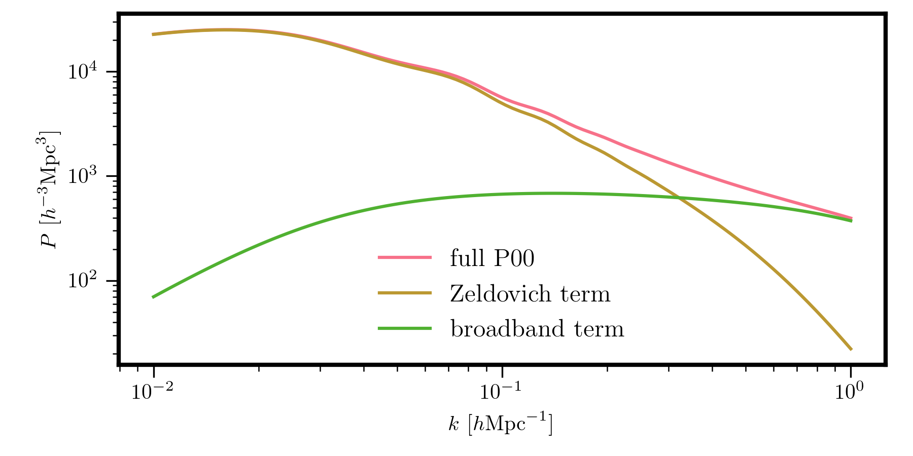
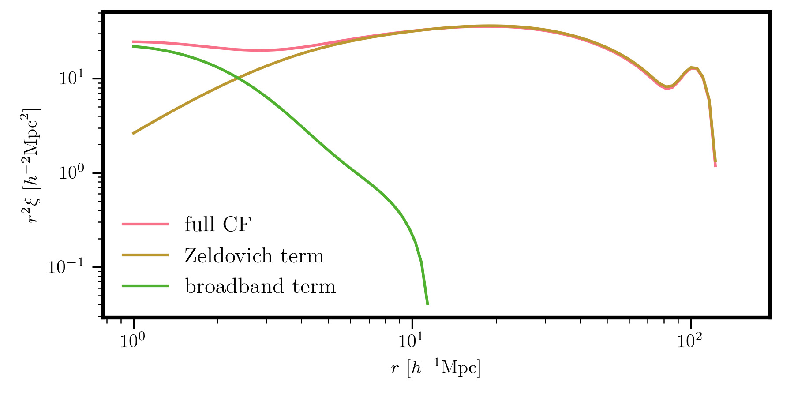

Overview
========

The :mod:`pyRSD.rsd.hzpt` module provides functionality for computing various
power spectrum and correlation function quantities using Halo Zel'dovich
Perturbation Theory (HZPT). See `Seljak and Vlah 2015 <https://arxiv.org/abs/1501.07512>`_
for an introduction to HZPT.

The Fourier space quantities can be computed from the following classes:

======================================== ==================================================================
Name                                     Quantity
======================================== ==================================================================
:attr:`~pyRSD.rsd.hzpt.HaloZeldovichP00` The dark matter auto power spectrum
:attr:`~pyRSD.rsd.hzpt.HaloZeldovichP01` The dark matter density - radial momentum cross correlation
:attr:`~pyRSD.rsd.hzpt.HaloZeldovichP11` The :math:`mu^4` contribution to the radial momentum auto spectrum
:attr:`~pyRSD.rsd.hzpt.HaloZeldovichPhm` The halo - dark matter cross power
======================================== ==================================================================

And the configuration space quantities can be computed from the following classes:

========================================= ==================================================
Name                                      Quantity
========================================= ==================================================
:attr:`~pyRSD.rsd.hzpt.HaloZeldovichCF00` The dark matter auto correlation function
:attr:`~pyRSD.rsd.hzpt.HaloZeldovichCFhm` The halo - dark matter cross correlation function
========================================= ==================================================

Initialization
~~~~~~~~~~~~~~

An HZPT instance can be initialized by specifying a cosmology via a
:class:`pyRSD.rsd.cosmology.Cosmology` object and a redshift ``z``.

.. note::

    The objects should be initialized at a specific redshift by passing
    the ``z`` parameter. Once created, the ``sigma8_z`` attribute can be adjusted
    to compute the clustering quantity at different redshifts.

Functions
~~~~~~~~~

The HZPT class objects are callable objects; they return either the HZPT power
spectrum or correlation function at the specified wavenumber ``k`` or
separation ``r``. The ``zeldovich`` function returns the Zel'dovich term and
the ``broadband`` function returns the Padé correction term.

Examples
~~~~~~~~

For example, to compute the dark matter auto spectrum for the Planck 2015
cosmology,

.. code-block:: python

    from pyRSD.rsd.cosmology import Planck15
    from pyRSD.rsd.hzpt import HaloZeldovichP00

    # power spectrum at z = 0
    P00 = HaloZeldovichP00(Planck15, z=0.)

    # compute the full power and each term
    k = np.logspace(-2, 0, 100)
    Pk = P00(k)
    Pzel = P00.zeldovich(k)
    Pbb = P00.broadband(k)

    # and plot
    plt.loglog(k, Pk, label='full P00')
    plt.loglog(k, Pzel, label='Zeldovich term')
    plt.loglog(k, Pbb, label='broadband term')

Similary, the dark matter correlation function and the various terms can
be computed as:

.. code-block:: python

    from pyRSD.rsd.hzpt import HaloZeldovichCF00

    # correlation function at z = 0
    CF = HaloZeldovichCF00(Planck15, z=0.)

    # compute the full correlation and each term
    r = np.logspace(0, np.log10(150), 100)
    xi = CF(r)
    xi_zel = CF.zeldovich(r)
    xi_bb = CF.broadband(r)

    # and plot
    plt.loglog(r, r**2 * xi, label='full CF')
    plt.loglog(r, r**2 * xi_zel, label='Zeldovich term')
    plt.loglog(r, r**2 * xi_bb, label='broadband term')

