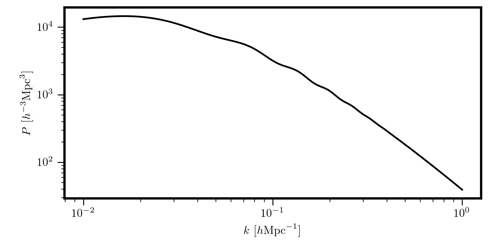
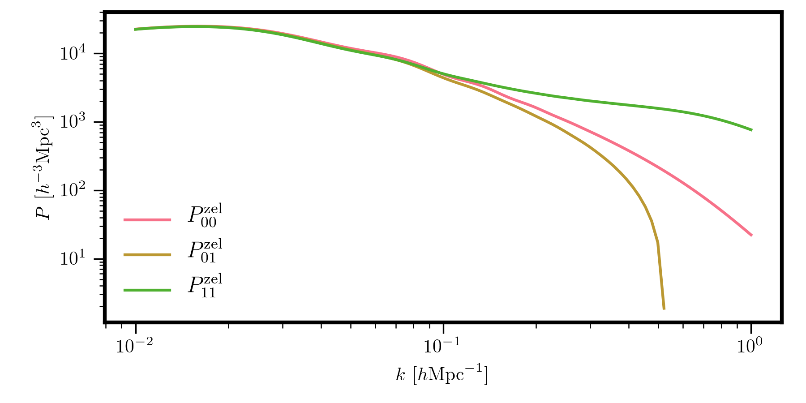
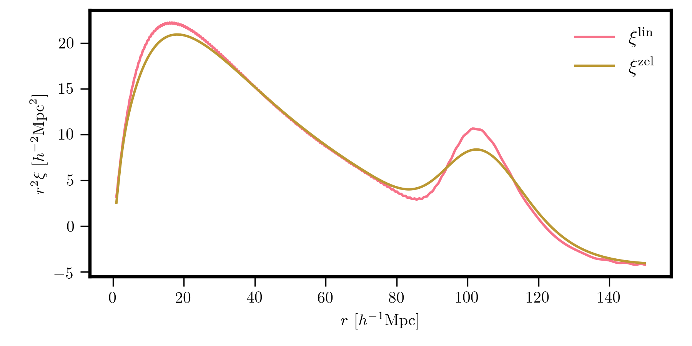

Overview
--------

The CLASS Cosmology object
~~~~~~~~~~~~~~~~~~~~~~~~~~

Although the main pyRSD modules require the use of the main
:class:`pyRSD.rsd.cosmology.Cosmology` class, the :mod:`pyRSD.pygcl` module
relies on the :class:`pyRSD.pygcl.Cosmology` class. A
:class:`pyRSD.pygcl.Cosmology` object can be easily initialized
from a :class:`pyRSD.rsd.cosmology.Cosmology` object via the
:func:`~pyRSD.rsd.cosmology.Cosmology.to_class` function, as

.. ipython:: python
    :suppress:

    import numpy

.. ipython:: python

    from pyRSD.rsd.cosmology import Planck15
    from pyRSD import pygcl

    class_cosmo = Planck15.to_class()
    print(class_cosmo)

Computing Background Quantities
~~~~~~~~~~~~~~~~~~~~~~~~~~~~~~~

The :class:`pyRSD.pygcl.Cosmology` calls the CLASS code to compute various
cosmological parameters and background quantities as a function of redshift
See :ref:`the API <pygcl-cosmo>` for the full list of available quantities
that CLASS can compute. For example, to compute the growth rate as a
function of redshift

.. ipython:: python

    z = numpy.linspace(0, 3, 100)
    growth = class_cosmo.f_z(z)

The Linear Power Spectrum
~~~~~~~~~~~~~~~~~~~~~~~~~~~~~~~~~~~~~~~~~~~~~~~

Most importantly for pyRSD, the :mod:`pyRSD.pygcl` module includes
functionality to compute the linear matter power spectrum using CLASS.
The main object for this calculation is the :class:`pyRSD.pygcl.LinearPS`
class, which can be initialized as

.. code-block:: python

    # initialize at z = 0
    Plin = pygcl.LinearPS(class_cosmo, 0)

    # renormalize to different SetSigma8AtZ
    Plin.SetSigma8AtZ(0.62)

    # evaluate at k
    k = numpy.logspace(-2, 0, 100)
    Pk = Plin(k)

    # plot
    plt.loglog(k, Pk, c='k')

Zel'dovich Power Spectra
~~~~~~~~~~~~~~~~~~~~~~~~

The :mod:`pyRSD.pygcl` module can also be used to directly compute
power spectra in the Zel'dovich approximation. For example,

.. code-block:: python

    # density auto power
    P00 = pygcl.ZeldovichP00(class_cosmo, 0)

    # density - radial momentum cross power
    P01 = pygcl.ZeldovichP01(class_cosmo, 0)

    # radial momentum auto power
    P11 = pygcl.ZeldovichP11(class_cosmo, 0)

    # plot
    k = numpy.logspace(-2, 0, 100)
    plt.loglog(k, P00(k), label=r'$P_{00}^\mathrm{zel}$')
    plt.loglog(k, P01(k), label=r'$P_{01}^\mathrm{zel}$')
    plt.loglog(k, P11(k), label=r'$P_{11}^\mathrm{zel}$')

The Correlation Function
~~~~~~~~~~~~~~~~~~~~~~~~

The :mod:`pyRSD.pygcl` module also includes functionality for computing
the linear and Zel'dovich correlation functions. This is computed by
taking the Fourier transform of the power spectrum using FFTLog.

.. code-block:: python

    # linear correlation function
    CF = pygcl.CorrelationFunction(Plin)

    # Zeldovich CF at z = 0.55
    CF_zel = pygcl.ZeldovichCF(class_cosmo, 0.55)

    # plot
    r = numpy.logspace(0, numpy.log10(150), 1000)
    plt.plot(r, r**2 * CF(r), label=r'$\xi^\mathrm{lin}$')
    plt.plot(r, r**2 * CF_zel(r), label=r'$\xi^\mathrm{zel}$')

