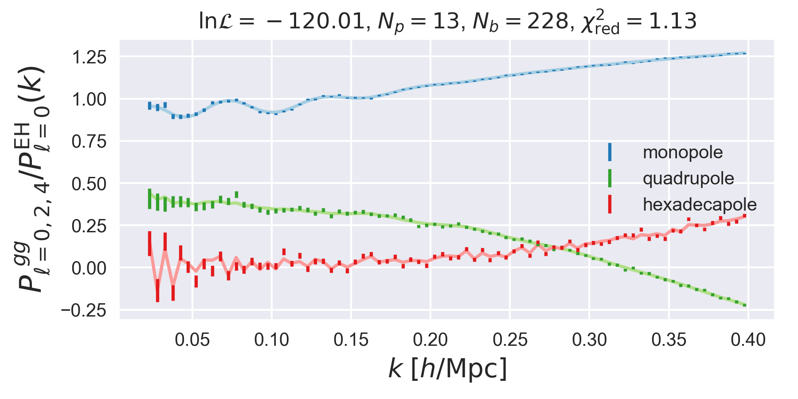
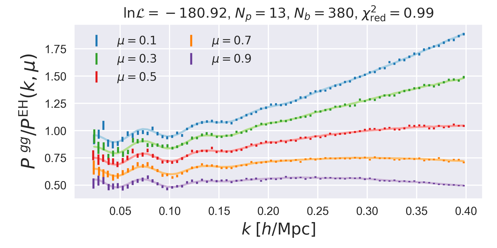

Quickstart
==========

The pyRSD package provides a number of examples in order to get users
up and running quickly. Once these examples have been downloaded, the
user can start running their own parameter fits using the example data
and parameter files. The executable responsible for downloading the pyRSD
examples is ``pyrsd-quickstart``, which has the following calling sequence:

.. command-output:: pyrsd-quickstart -h

The first argument provided to the command is the name of the example
to download, which should be of the following:

===================== ===============================================================================================
**Example Name**      **Description**
galaxy/periodic-pkmu  Fitting :math:`P(k,\mu)` galaxy data from a periodic box simulation
galaxy/periodic-poles Fitting :math:`P_\ell(k)` galaxy data from a periodic box simulation
galaxy/survey-poles   Fitting :math:`P_\ell(k)` galaxy data from a simulation with a realistic survey window function
===================== ===============================================================================================

And the second argument is the name of the directory to download the files too.
So, for example, to download the files from the ``periodic-poles`` examples to
a directory called ``pyRSD-example`` simply do

.. code-block:: bash

    pyrsd-quickstart galaxy/periodic-poles pyRSD-example

Running Parameter Fits
----------------------

With the example downloaded, the user can run MCMC or nonlinear optimization
fits using the default model parametrization with the ``rsdfit`` command.
See :ref:`free-params` for a table of the default free parameters and
:ref:`constrained-params` for a table of the default constrained parameters.

For example, to run 10 nonlinear optimization steps (using the LBFGS
optimization algorithm), you can do

.. code-block:: bash

    rsdfit nlopt -m pyRSD-example/model.npy -p pyRSD-example/params.dat -o pyRSD-example-results -i 10

or to run 10 MCMC iterations (using 30 :mod:`emcee` walkers), you can do

.. code-block:: bash

    rsdfit mcmc -m pyRSD-example/model.npy -p pyRSD-example/params.dat -o pyRSD-example-results -i 10 -w 30

The number of iterations has been set to 10 here just for illustration purporse.
Typically, the LBFGS algoritm will take :math:`\sim100-200` steps to converge,
and the mcmc algorithm will need 1000s of iterations to fully explore the
posterior distributions of the parameters.

Analyzing the Fit Results
-------------------------

The ``rsdfit`` saves the best-fit parameter set to a numpy ``.npz`` file in
the directory specified via the ``-o`` output, which is ``pyRSD-example-results``
in the example above. There are two Python objects in pyRSD that can read these
files, depending on the type of fit that was run. For ``mcmc`` fits, use the
:class:`pyRSD.rsdfit.results.EmceeResults` class and for ``nlopt`` fits, use
the :class:`pyRSD.rsdfit.results.LBFGSResults` class.

.. ipython:: python
    :suppress:

    import os
    startdir = os.path.abspath('.')
    home = startdir.rsplit('docs' , 1)[0]
    os.chdir(home); os.chdir('docs/data')

For example, to explore the fitting results from a ``mcmc`` fit

.. ipython:: python

    from pyRSD.rsdfit.results import EmceeResults, LBFGSResults

    mcmc_results = EmceeResults.from_npz('mcmc_result.npz')

    # print out a summary of the parameters, with mean values and 68% and 95% intervals
    print(mcmc_results)

    # access parameters like a dictionary
    fsat = mcmc_results['fs']

    print(fsat.median)

and to explore the fitting results from a ``nlopt`` fit

.. ipython:: python

    nlopt_results = LBFGSResults.from_npz('nlopt_result.npz')

    # print out a summary of the parameters, with best-fit values
    print(nlopt_results)

    # access best-fit values like a dictionary
    fsat = nlopt_results['fs']

    print(fsat)

Comparing the Best-fit Model to Data
------------------------------------

Users can compare the best-fitting model to the data by loading the
results of a fitting run using the :class:`pyRSD.rsdfit.FittingDriver`.
We can easily initialize this object by passing the directory where the results
were written to the :class:`pyRSD.rsdfit.FittingDriver.from_directory` function.
For the example data downloaded above, we can explore both the data
and theory simulataneously using the included result file
``nlopt_result.npz``:

.. code-block:: python

    from pyRSD.rsdfit import FittingDriver

    # load the model and results into one object
    d = FittingDriver.from_directory('pyRSD-example', model_file='pyRSD-example/model.npy', results_file='pyRSD-example/nlopt_result.npz')

    # set the fit results
    d.set_fit_results()

    # the best-fit log probability (likelihood + priors)
    print(d.lnprob())

    # the best-fit chi2
    print(d.chi2())

    # the best-fit reduced chi2
    print(d.reduced_chi2())

    # make a plot of the data vs the theory
    d.plot()
    show()

In this plot, we show the monopole, quadrupole, and hexadecapole normalized
by the smooth, no-wiggle `Eisenstein and Hu <https://arxiv.org/abs/astro-ph/9710252>`_
monopole. All of the above steps are identical if we are analyzing :math:`P(k,\mu)`
data rather than :math:`P_\ell(k)` data. For example, if the ``periodic-pkmu``
example is downloaded, running the function :func:`FittingDriver.plot` using
the included result file ``nlopt_result.npz`` produces the following figure:

This plot shows the best-fit theory and data for 5 wide :math:`\mu` bins, normalized
by the linear Kaiser :math:`P(k,\mu)`, using the no-wiggle Eisenstein and Hu
linear power spectrum.

.. ipython:: python
    :suppress:

    import os
    os.chdir(startdir)
